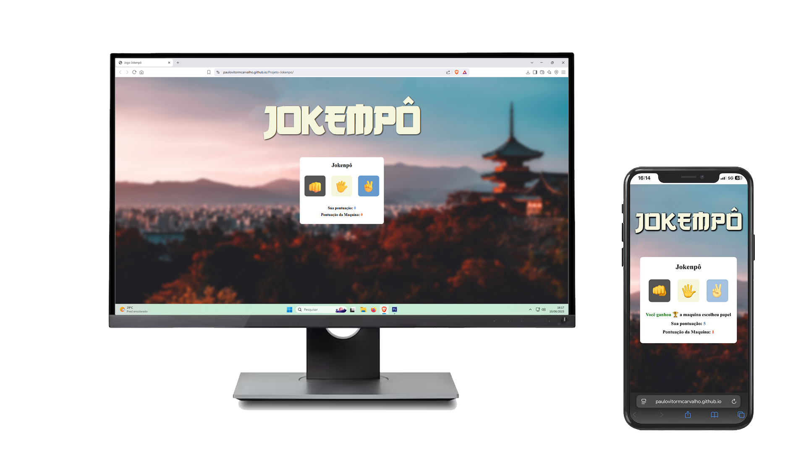

# 🥊 Jokenpô - Pedra, Papel e Tesoura

Um jogo interativo de **Jokenpô (pedra, papel e tesoura)** desenvolvido com **HTML5**, **CSS3** e **JavaScript puro**. O usuário joga contra a máquina, que escolhe aleatoriamente uma das três opções. O placar é atualizado a cada rodada, e o jogo possui uma interface simples, responsiva e intuitiva.

## 🎮 Funcionalidades

- Escolha entre pedra, papel ou tesoura
- A máquina realiza uma jogada aleatória
- Resultado exibido na tela (vitória, derrota ou empate)
- Placar atualizado em tempo real
- Estilo visual com botões personalizados, fundo temático e fontes customizadas

## 📸 Imagem do projeto



## 🚀 Tecnologias utilizadas

- HTML5
- CSS3 (com responsividade e estilização personalizada)
- JavaScript (manipulação do DOM e lógica do jogo)

## 🧠 Aprendizados

Esse projeto me ajudou a consolidar conhecimentos fundamentais, como:

- Manipulação do DOM com JavaScript
- Funções, condicionais e lógica de jogo
- Organização de arquivos em um projeto web
- Estilização com CSS moderno e responsivo

## 📁 Como executar

1. Clone o repositório:
   ```bash
   git clone https://github.com/seu-usuario/jokenpo.git
